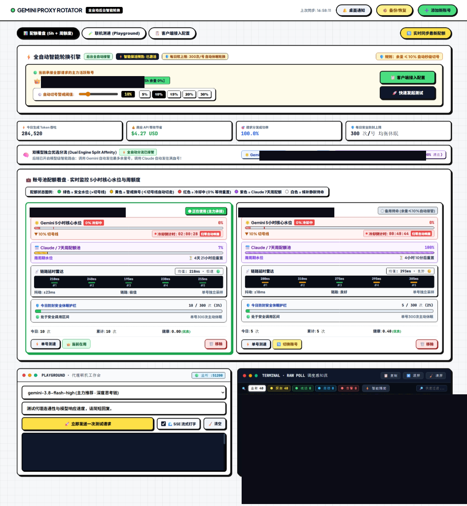

# 双子代理转子 · Gemini Proxy Rotator

> 多账号智能轮换 | 双模型独立优选分流 | 极客仪表盘

[](LICENSE)
[](https://nodejs.org)
[](https://github.com/ygwbl/Gemin-Proxy-Rotator)

---

## 📸 界面预览



---

## ✨ 核心功能

| 功能 | 说明 |
|------|------|
| 🧠 双模型独立优选分流 | Gemini → 配额最高账号；Claude → 配额最高账号，200% 产能压榨 |
| 📊 极客仪表盘 | 配额水位、健康分、冷却倒计时、延时雷达，实时一屏掌控 |
| ⏳ 冷却动态倒计时 | 动态跳动倒计时，归零瞬间自动微探测激活 |
| 📡 延时雷达 | 最近 5 次 RTT 均值与波动曲线，哪个账号延迟低一目了然 |
| 📈 Token/USD 看板 | 今日 Token 吞吐、商业 API 节省金额、请求成功率 |
| 🛡️ 防封护栏 | 单账号达 300 次/日自动休眠轮换，规避 Google 风控降权 |
| 💾 备份/恢复 | 账号配置一键导出导入，换机无痛迁移 |

---

## 🚀 快速开始（3 步上手）

### 前置条件
- Windows 系统
- [Node.js](https://nodejs.org) >= 18
- 已有 Google 账号（登录过 Cursor / Gemini）

### 第一步：克隆仓库
```bash
git clone https://github.com/ygwbl/Gemin-Proxy-Rotator.git
cd Gemin-Proxy-Rotator
```

### 第二步：一键安装
双击运行 `install.bat`，脚本会自动：
1. 检测并安装 `tuxevil-rotator`
2. 替换极客仪表盘 UI
3. 替换双模型分流核心逻辑

### 第三步：启动代理
```bash
tuxevil-rotator start
```
浏览器打开 **http://localhost:51200** 即可看到仪表盘。

---

## 🔧 手动安装（可选）

```powershell
# 1. 安装基础依赖
npm install -g tuxevil-rotator

# 2. 获取 npm 全局路径
$npmRoot = npm root -g

# 3. 替换仪表盘 UI
Copy-Item src\static\gemini-dashboard.html "$npmRoot\tuxevil-rotator\src\static\gemini-dashboard.html" -Force

# 4. 替换双模型分流核心
Copy-Item patches\proxy.ts "$npmRoot\tuxevil-rotator\src\proxy.ts" -Force

# 5. 启动
tuxevil-rotator start
```

---

## 🧠 双模型分流原理

每次 API 请求进入时，`applyAutoModelAffinity()` 自动扫描所有账号余量：

```
Gemini 请求  →  选 Gemini percentRemaining 最高的账号
Claude 请求  →  选 Claude percentRemaining 最高的账号
```

两个账号同时工作，互不干扰，压榨出 **200% 的满血额度**。

---

## 📁 仓库结构

```
├── src/static/
│   └── gemini-dashboard.html   # 极客仪表盘（全量定制 UI）
├── patches/
│   └── proxy.ts                # 双模型分流核心逻辑
├── docs/
│   ├── screenshot1.png         # 总览面板截图
│   └── screenshot2.png         # 账号详情截图
├── install.bat                  # Windows 一键安装脚本
└── README.md
```

---

## License

MIT © [ygwbl](https://github.com/ygwbl)

