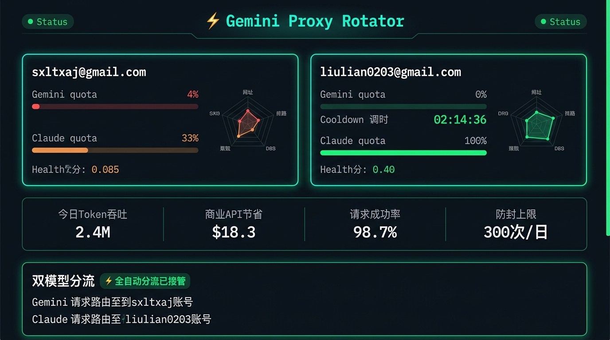

# 双子代理转子 · Gemini Proxy Rotator

> 多账号智能轮换 | 双模型独立优选分流 | 极客仪表盘

[](LICENSE)

---



---

## ✨ 核心功能

### 🧠 双模型独立优选分流（Dual Engine Split Affinity）
- **Gemini 模型** → 自动路由至 Gemini 配额最高的账号
- **Claude 模型** → 自动路由至 Claude 配额最高的账号
- 实现双账号 200% 产能压榨，Cursor / API 调用零感切换

### 📊 极客仪表盘（Gemini Dashboard）
- 账号卡片实时显示：Gemini/Claude 双配额水位、健康分、倒计时
- **延时雷达**：最近 5 次 RTT 均值与波动曲线，延迟高低一目了然
- **冷却倒计时钟**：动态跳动倒计时，归零瞬间自动微探测激活
- **Token/USD 看板**：今日 Token 吞吐、商业 API 节省、请求成功率
- **双模型分流面板**：实时显示 Gemini/Claude 各自主控账号
- **备份/恢复**：账号配置一键导出导入

### 🛡️ 防封护栏（Daily Budget Guard）
- 单账号当日请求达 300 次时自动休眠轮换
- 多号均衡负载，规避 Google 风控降权

---

## 📁 仓库结构

```
├── src/static/
│   └── gemini-dashboard.html   # 极客仪表盘主页面（全量定制 UI）
├── patches/
│   └── proxy.ts                # 代理核心改动（双模型分流逻辑）
├── docs/
│   └── dashboard-preview.jpg   # 仪表盘预览图
└── README.md
```

---

## 🚀 使用方式

本项目为 [tuxevil-rotator](https://www.npmjs.com/package/tuxevil-rotator) 的**定制补丁层**。

### 1. 安装基础依赖
```bash
npm install -g tuxevil-rotator
```

### 2. 替换定制文件（Windows PowerShell）
```powershell
$npmRoot = npm root -g

# 替换仪表盘 UI
Copy-Item src\static\gemini-dashboard.html `
  "$npmRoot\tuxevil-rotator\src\static\gemini-dashboard.html" -Force

# 替换代理核心（含双模型分流逻辑）
Copy-Item patches\proxy.ts `
  "$npmRoot\tuxevil-rotator\src\proxy.ts" -Force
```

### 3. 启动代理
```bash
tuxevil-rotator start
# 仪表盘地址：http://localhost:51200
```

---

## 🔧 双模型分流原理

`patches/proxy.ts` 中注入了 `applyAutoModelAffinity()` 函数：

```typescript
// 每次请求前自动扫描所有账号
// 按 percentRemaining 最高原则更新 activeAccountIndex
// Gemini 模型 → 选 Gemini 配额最高账号
// Claude 模型 → 选 Claude 配额最高账号
```

在三个关键入口注入调用：
1. `handleChatCompletions` 循环入口
2. `handleCompletionsStream` 循环入口
3. `/api/status` 路由

---

## License

MIT © ygwbl
